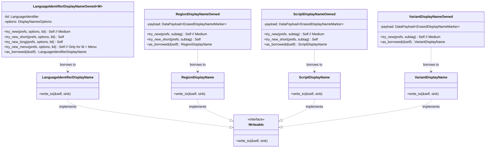

# Single Display Names

This module provides formatters for loading and rendering a single localized display name at a time. 

Unlike the `multi` module, which loads the entire database of names for a given type (e.g., all regions) into a `ZeroMap`, the `single` module loads only the data necessary for the specific subtag or identifier requested. This is highly optimized for binary size and memory usage in resource-constrained environments where only a few names are needed at runtime.

For usage examples, see the integration tests in `tests/displaynames/tests.rs`.

## Type Architecture

The following diagram shows the relationships between the owned and borrowed types in the `single` module, and their implementation of the `Writeable` trait:

## Formatters & Constructors

The module provides the following formatters, each with a borrowed version and an `Owned` version that holds the data lifetime. 

### Width-Specific Constructors
According to CLDR data, different subtags support different width/length variants:
*   **Languages**: Short, Medium (default), and Long.
*   **Regions**: Short and Medium (default).
*   **Scripts**: Short and Medium (default).
*   **Variants**: Medium (default) only.

To reflect this, each formatter provides explicit constructors for each supported width. The default constructor `try_new` always loads the **Medium** width.

### Value-Passing
All owned constructors take their target subtag or `LanguageIdentifier` **by value** because the owned struct needs to store the identifier for fallback purposes, and copying/moving these identifiers is highly efficient in ICU4X (using `TinyStr` under the hood).

*   **`LanguageIdentifierDisplayName` / `LanguageIdentifierDisplayNameOwned<M>`**: Formats a full `LanguageIdentifier` (language, script, region, and variants) into a localized string. It is generic over the display model (Standard/Dialect vs. Menu).
    *   `LanguageIdentifierDisplayNameOwned::try_new(prefs, options, lid)`: Constructor for **Medium** width (Standard/Dialect).
    *   `LanguageIdentifierDisplayNameOwned::try_new_short(prefs, options, lid)`: Constructor for **Short** width (Standard/Dialect).
    *   `LanguageIdentifierDisplayNameOwned::try_new_long(prefs, options, lid)`: Constructor for **Long** width (Standard/Dialect).
    *   `LanguageIdentifierDisplayNameOwned::try_new_menu(prefs, options, lid)`: Constructor for **Menu** style (Medium width).
*   **`RegionDisplayName` / `RegionDisplayNameOwned`**: Formats a single `Region` subtag (e.g., `US` -> "United States").
    *   `RegionDisplayNameOwned::try_new(prefs, subtag)`: Constructor for **Medium** width.
    *   `RegionDisplayNameOwned::try_new_short(prefs, subtag)`: Constructor for **Short** width.
*   **`ScriptDisplayName` / `ScriptDisplayNameOwned`**: Formats a single `Script` subtag (e.g., `Latn` -> "Latin").
    *   `ScriptDisplayNameOwned::try_new(prefs, subtag)`: Constructor for **Medium** width.
    *   `ScriptDisplayNameOwned::try_new_short(prefs, subtag)`: Constructor for **Short** width.
*   **`VariantDisplayName` / `VariantDisplayNameOwned`**: Formats a single `Variant` subtag (e.g., `valencia` -> "Valencian").
    *   `VariantDisplayNameOwned::try_new(prefs, subtag)`: Constructor for **Medium** width.

---

## Data Markers & Indexing

The `single` module uses the following data markers. Because it loads names for specific subtags at runtime, it utilizes a two-level indexing strategy combining the target **locale** (for translation) and **marker attributes** (for the subtag).

### 1. Subtag Display Names (Indexed by Locale + Marker Attribute)
These markers contain the localized name for a specific subtag. They are indexed by the **locale** of the translation (e.g., `en`) and a **marker attribute** containing the BCP-47 subtag string (e.g., `US`, `Latn`, `zh`).

*   **`LocaleNamesLanguageShortV1` / `LocaleNamesLanguageMediumV1` / `LocaleNamesLanguageLongV1`**:
    *   *Attribute*: Language subtag (e.g., `en`, `zh`).
    *   *Description*: Contains a single string representing the localized short, medium, or long name for the language.
*   **`LocaleNamesScriptShortV1` / `LocaleNamesScriptMediumV1`**:
    *   *Attribute*: Script subtag (e.g., `Latn`, `Hant`).
    *   *Description*: Contains a single string representing the localized short or medium name for the script.
*   **`LocaleNamesRegionShortV1` / `LocaleNamesRegionMediumV1`**:
    *   *Attribute*: Region subtag (e.g., `US`, `FR`, `001`).
    *   *Description*: Contains a single string representing the localized short or medium name for the region.
*   **`LocaleNamesVariantMediumV1`**:
    *   *Attribute*: Variant subtag (e.g., `valencia`).
    *   *Description*: Contains a single string representing the localized medium name for the variant.
*   **`LocaleNamesLanguageMenuMediumV1`**:
    *   *Attribute*: Language subtag (e.g., `zh`).
    *   *Description*: Contains the split "core" and "extension" parts of the localized menu name (used for hierarchical dropdowns).

### 2. Formatting Patterns (Indexed by Locale Only)
These markers contain the patterns used to combine subtags. They are indexed by the **locale** only, as the patterns apply to all formatting operations for that language.

*   **`LocaleNamesEssentialsV1`**:
    *   *Attribute*: None (indexed by locale only).
    *   *Contains*:
        *   `localePattern`: The pattern used to combine the base language name with qualifiers (e.g., `"{0} ({1})"`).
        *   `localeSeparator`: The separator used to join multiple qualifiers (e.g., `"{0}, {1}"`).

---

## Architecture & Design

The `single` module adheres to general ICU4X design principles to support `no_std` environments and minimize resource usage:

*   **Lazy Formatting (`Writeable`)**: Formatters do not allocate `String`s upon construction. Instead, they store the raw identifiers and loaded `DataPayload`s, deferring formatting until `Writeable::write_to` is called to write directly to the output sink.
*   **Stack Optimization**: We leverage standard ICU4X patterns like `DataPayloadOr` to store optional payloads (e.g., optional script/region) without the stack size overhead of `Option<DataPayload>`.
*   **Payload Erasing**: We use `ErasedMarker` to allow fields to hold different width variants of the payloads polymorphically at runtime, sharing the same underlying `VarZeroCow<'static, str>` data struct.
    *   *Type Alias*: `pub(crate) type ErasedDisplayNameMarker = icu_provider::marker::ErasedMarker<VarZeroCow<'static, str>>;`
    *   *Benefit*: This allows the same owned struct (e.g., `LanguageIdentifierDisplayNameOwned`) to store data loaded from different width markers (Short, Medium, or Long) depending on which constructor was called, keeping the struct type width-agnostic.
*   **Zero-Allocation Interpolation**: We use the `icu_pattern` crate to interpolate the base language and qualifiers (joined by `localeSeparator`) directly into the output sink.

### Generic Owned Type with Shared Borrowed Type

To support both standard formatting and the specialized Menu style (which requires `LocaleNamesLanguageMenuMediumV1` wrapping `MenuNameParts` instead of `str`), we use a single generic owned type `LanguageIdentifierDisplayNameOwned<M>` that delegates its language payload type to a model trait, inspired by the `Model` generic in `TimeZoneInfo`.

#### 1. The Model Trait and Implementations
We define a `LanguageIdentifierDisplayNameModel` trait with an associated type `LanguagePayload`. 

We implement this trait for two marker models:
*   **`models::Standard`**: Used for Standard and Dialect display styles. The `LanguagePayload` is `DataPayloadOr<ErasedDisplayNameMarker, ()>`.
*   **`models::Menu`**: Used for Menu display style. The `LanguagePayload` is `DataPayload<LocaleNamesLanguageMenuMediumV1>`.

#### 2. The Generic Owned Struct
`LanguageIdentifierDisplayNameOwned<M>` holds the `LanguageIdentifier`, `DisplayNamesOptions`, the generic `language_payload` (determined by `M`), optional `script_payload` and `region_payload` (both using `DataPayloadOr` with `ErasedDisplayNameMarker`), a vector of `variant_payloads` (using `ErasedDisplayNameMarker`), and the `pattern_payload` (using `LocaleNamesEssentialsV1`).

> [!NOTE]
> **Allocation Papercut**: Storing `variant_payloads` in a `Vec` requires heap allocation, which prevents this struct from being strictly allocation-free in `no_std` environments without an allocator. 
> 
> *Follow-up (TODO #7825)*: We should explore using a stack-allocated collection like `SmallVec` (e.g., `SmallVec<[DataPayload<ErasedDisplayNameMarker>; 1]>`) to eliminate heap allocation for the vast majority of locales that have zero or one variant.

#### 3. The Shared Borrowed Struct
Both models resolve their payload differences and borrow to a single, non-generic **`LanguageIdentifierDisplayName<'a>`** struct. 

This struct holds only cheap, borrowed references:
*   `base_name`: The resolved base language name (or "core" part for menu style) as a `&'a str`.
*   `menu_extension`: The optional menu extension part as an `Option<&'a str>`.
*   `script_name` and `region_name`: Optional resolved names as `Option<&'a str>`.
*   `variants`: A borrowed slice of variant payloads (`&'a [DataPayload<ErasedDisplayNameMarker>]`). We borrow the payloads directly rather than extracting a dereferenced list of `&'a str`s to avoid heap allocation during `as_borrowed()`. While a dereferenced list would be cleaner, this zero-allocation design is preferred and acceptable since variants are rarely present and not on a hot path.
*   `locale_pattern` and `locale_separator`: Borrowed patterns from the pattern payload.

#### 4. Resolution in `as_borrowed()`
The differences are resolved in the model-specific implementations of `as_borrowed()`:
*   For the **`Standard`** model: `base_name` is resolved from `language_payload` (falling back to the raw BCP-47 language subtag if missing), and `menu_extension` is `None`.
*   For the **`Menu`** model: `base_name` is resolved from `language_payload.get().core`, and `menu_extension` is `Some(language_payload.get().extension)`.

#### 5. Zero-Allocation Formatting Pipeline
In `Writeable::write_to` for `LanguageIdentifierDisplayName<'a>`, we treat `menu_extension` (if present), `script_name`, `region_name`, and the resolved variant names as qualifiers. A stack-allocated `QualifiersWriteable` helper joins them using `locale_separator` directly into the sink, and `icu_pattern::Pattern::interpolate` combines `base_name` and the qualifiers into `locale_pattern` directly into the output sink without any heap allocation.

---

## UTS #35 Compliance

The formatting algorithm strictly follows **UTS #35 Part 3: Section 3 (Locale Display Names)**.

### 1. Locale Display Patterns (UTS #35 §3.1)
We load `LocaleNamesEssentialsV1` which contains pre-parsed `DoublePlaceholderPattern`s from CLDR:
*   **`localePattern`**: Combines the language with qualifiers (e.g., `"{0} ({1})"`).
*   **`localeSeparator`**: Joins multiple qualifiers (e.g., `"{0}, {1}"`).

### 2. Dialect vs. Standard Handling (UTS #35 §3.1)
We support two language display modes via `LanguageDisplay` (matching ECMA-402):
*   **`LanguageDisplay::Dialect`**: The formatter first attempts to load a specific dialect name matching the identifier (e.g., `en-GB` -> "British English"). If not found, it falls back to `Standard`.
*   **`LanguageDisplay::Standard`**: The formatter bypasses dialect lookup and constructs the name from the base language and qualifiers (e.g., `en-GB` -> "English (United Kingdom)").

*Note: Menu style is not part of this option, as it is handled by a separate constructor.*

### 3. Variant Names (UTS #35 §3.15)
Localized variant names are loaded individually and appended to the qualifiers list, joined by the `localeSeparator`.

### 4. Menu Style Support (UTS #35 §3.1 & CLDR-19336)
We support Menu style using `LocaleNamesLanguageMenuMediumV1` (which contains `MenuNameParts` with `core` and `extension` fields) for dropdown menus. The `core` part is displayed as the main language name, and the `extension` is joined with other qualifiers.

As per [CLDR-19336](https://unicode-org.atlassian.net/browse/CLDR-19336), some languages in CLDR have an `alt="menu"` name. During datagen/loading, if an `alt="menu"` name is present, we construct the `MenuNameParts` payload using that string as the `core` part, with an empty `extension` part.

---

## Limitations & Future Work

The following features defined in UTS #35 are currently not supported and are planned for future releases:

1.  **Locale Extension Keywords (UTS #35 §3.2)**: Formatting Unicode extension keys and types (e.g., `-u-ca-gregory` -> "Calendar: Gregorian") using `localeKeyTypePattern`.

---

## Open Questions

1.  **Writeable on Owned Types**:
    Owned types like `ScriptDisplayNameOwned`, `RegionDisplayNameOwned`, `VariantDisplayNameOwned`, and `LanguageIdentifierDisplayNameOwned` implement `Writeable` (by forwarding to their borrowed counterparts via `.as_borrowed()`).
    *   *Resolution*: We decided to keep implementing `Writeable` directly on owned types for convenience, as there is no harm in having multiple `Writeable` implementations.
2.  **Constructor Argument Order**:
    In `LanguageIdentifierDisplayNameOwned::try_new(prefs, locale_id, options)`, we have placed `options` last.
    *   *Resolution*: This aligns with the standard ICU4X API style, as `options` behaves like a trailing optional bag.
3.  **Fallback Behavior in Single Formatters**:
    Currently, single formatters (`Script`, `Region`, `Variant`, `Language`) fail-fast in the constructor (`try_new` returns `Err(DataError)`) if the specific subtag data is missing from the provider (e.g., `xx` or an untranslated language).
    *   *Resolution*: We will redesign the single formatters to support falling back to the code instead of failing with `DataError`. This has been deferred to a follow-up issue: [#8100](https://github.com/unicode-org/icu4x/issues/8100).

